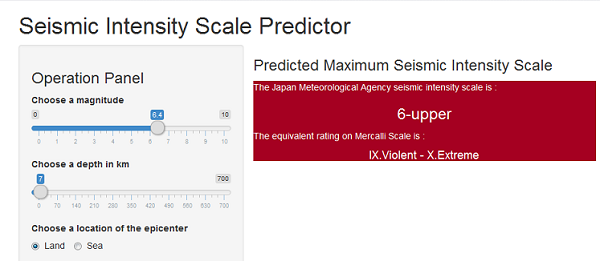

Prediction of the Seismic Intensity Scale
========================================================
author: Yuko Torii
date: October 7, 2016
autosize: true

<style>
/* code */
.reveal pre code { 
  font-size: 100%;
}

.reveal p {
  font-size: 90%;
}

.reveal ul {
  font-size: 90%;
}
</style>

Overview
========================================================

### Purpose
The purpose of this project is to predict a maximum [seismic intensity scale](https://en.wikipedia.org/wiki/Japan_Meteorological_Agency_seismic_intensity_scale) (which is called *Shindo* in Japanese) of earthquakes.

### The Seismic Intensity Scale
The seismic intensity scales are values observed using seismic intensity meters installed on the ground or on the first floor of low-rise buildings.
For more details please visit <http://www.jma.go.jp/jma/en/Activities/inttable.html>.


### Why Predict?
Because it will help you to estimate harm and damage by earthquakes 
even if no seismic intensity meters are installed.

How to Use
========================================================

Choose a *magnitude*, a *depth* (in km) and a *location* of the epicenter
from the Operation Panel, then the predicted *maximum seismic intensity scale* will be shown on the right panel.



This application can also show the equivalent rating on [Mercalli Scale](https://en.wikipedia.org/wiki/Mercalli_intensity_scale) for those who are not familiar with the JMA seismic intensity scale.

How to Predict - Data
========================================================

The original data for this project is taken from [here] (http://www.data.jma.go.jp/svd/eqdb/data/shindo/index.php).
The project uses:
* Seismic Scale 3 or larger from the year 2011
* Seismic Scale 6-upper or larger from the year 1923

The number of rows for each scale is shown as follows:


```r
# Locations of the epicenter with Japanese words "oki", "wan"
# and "kinkai" are categorized as "sea", otherwise "land".
hypocenters <- read.csv("hypocenter_list.csv")
hypocenters <- na.omit(hypocenters)
table(hypocenters$max_seismic_scale)
```

```

      3       4 5_lower 5_upper 6_lower 6_upper       7 
   2037     561      85      70      31      28       5 
```

How to Predict - A Model
========================================================


```r
library(caret); library(C50)
hypocenters <- hypocenters[,2:5]; set.seed(201609)
trainIndex <- createDataPartition(hypocenters$max_seismic_scale,
                                  p=0.7, list=FALSE)
training <- hypocenters[trainIndex,]
testing <- hypocenters[-trainIndex,]
model <- C5.0(training[-4], training$max_seismic_scale, trials=10)
pred <- predict(model, testing) 
matrix <- confusionMatrix(pred, testing$max_seismic_scale)
matrix$table
```

```
          Reference
Prediction   3   4 5_lower 5_upper 6_lower 6_upper   7
   3       578 120       4       6       4       0   0
   4        32  45      16       6       1       2   1
   5_lower   1   1       4       4       0       0   0
   5_upper   0   1       0       5       4       1   0
   6_lower   0   0       0       0       0       0   0
   6_upper   0   1       1       0       0       5   0
   7         0   0       0       0       0       0   0
```
I chose the **boosted C5.0 decision tree algorithm** for training a model among the C5.0 decision tree, the boosted C5.0 decision tree and random forests because it had the highest accuracy(0.7556346).
